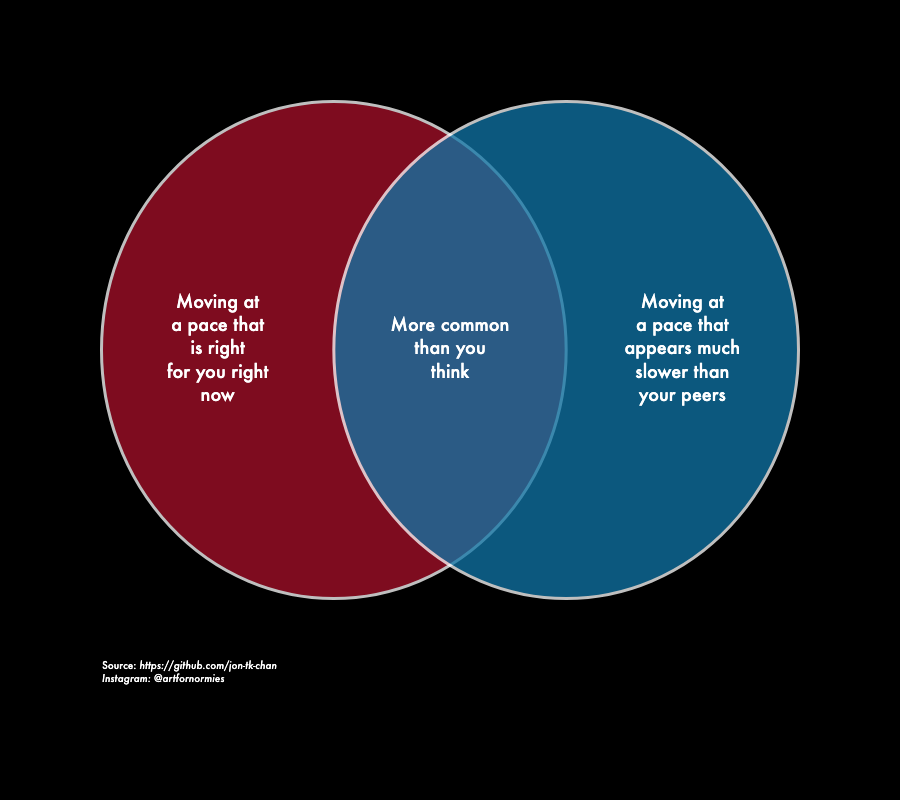

### Overview
Data visualization package built on [Python Plotly](https://plotly.com/python/). Use Artfornormies to create personal reminder graphs as shown on the [Artfornormies Instagram](https://www.instagram.com/artfornormies/?hl=en).

Purpose: to develop data visualization style that aid in personal writing and self reflection topics. Intended audience for visuals include:
- artists and creatives who struggle with perfectionism and minimization of own work
- 20-30 somethings that struggle with social media comparison and quarterlife decision-making
- younger self

Inspired by the work of Instagram content creators: [@mattsurelee](https://www.instagram.com/mattsurelee/?hl=en) , [@wetheurban](https://www.instagram.com/wetheurban/?hl=en), [@lizandmollie](https://www.instagram.com/lizandmollie/?hl=en)

### Installation
Install using pip:
```
pip install artfornormies
```
### Usage

Generate a visual using one of the listed functions:
```
from artfornormies.object_graphs import Chart

afn = Chart(fig_width = 900, fig_height=800,night_mode = True, opacity_val=0.75,
                title_size=20, axis_label_size=20, tick_label_size=16, label_size=18, anno_size=10,
                label_charlen=9, anno_text= "Source: <i>https://github.com/jon-tk-chan</i><br><i>Instagram: @artfornormies</i>"
            )

afn.create_venn_2(text_labels=["Moving at a pace that is right for you right now", 
                              "Moving at a pace that appears much slower than your peers",
                              "More common than you think"],
                  main_title="")

fig.write_image("images/ex_plot.png")
```



### Dependencies

Ensure that [Python Plotly](https://plotly.com/python/) is installed on your current Python Environment.

### Documentation

| Plot type              | Function name              | Purpose                                                                                                                                                                                                                                                                                           | Data parameters                                                                                                                                                                                                                             | layout parameters                                                                                                                                                                     |
|------------------------|----------------------------|---------------------------------------------------------------------------------------------------------------------------------------------------------------------------------------------------------------------------------------------------------------------------------------------------|---------------------------------------------------------------------------------------------------------------------------------------------------------------------------------------------------------------------------------------------|---------------------------------------------------------------------------------------------------------------------------------------------------------------------------------------|
|    <br>Scatter plot    |    <br>create_scatter()    |    <br>Compare categorical datapoints using 2 continuous numerical axes. <br>Use to show major differences in one dimension while highlighting relatively similar values in another dimension.  <br><br>ex: Comparing what you post about vs what you spend your time on                          | x_vals: list of floats, <br>y_vals: list of floats, <br>text_vals: list of str, <br>main_title: str, <br>x_title: str, <br>y_title: str,<br>anno_text: str,                                                                                 | color_by_y: boolean, <br>main_colorscale: predefined colorcale variables(list of 2 item lists in [float, str]), <br>night_mode: boolean,<br>label_size: int,<br>label_charlen: int    |
|    <br>Venn Diagram    |    <br>create_venn_2()     |    <br>Highlight shared quality between 2 categorical data points. <br>Use for highlighting similarities between 2 seemingly contradictory datapoints.  <br><br>ex: the things you say about yourself vs the things you would never say to a loved one                                            | venn_labels: list of 3 str (format: [left_text, right_text, intersection])<br>main_title: str,<br><br>anno_text: str,                                                                                                                       | fill_venn: boolean,<br>left_color: str,<br>right_color: str,<br>night_mode: boolean                                                                                                   |
|    <br>Bar Chart       |    <br>create_bar()        |    <br>Compare categorical data points using 1 continuous numerical axis. <br>Use for showing differences in the numerical value of multiple categories.  <br>   <br>ex: the types of job application responses (or lack thereof) and how attention you pay to them when evaluating self-worth    | y_vals: list of floats, <br>text_vals: list of str, <br>main_title: str, <br><br>x_title: str, <br>y_title: str,<br>anno_text: str,                                                                                                         | bar_color: str, <br>night_mode: boolean, <br>label_size: int, <br>label_charlen: int                                                                                                  |
|    <br>Heatmap         |    <br>create_heatmap()    |    <br>Compare categorial datapoints using 2 bivariate dimensions.<br>Use for 2x2 pairwise comparison of multiple datapoints.   <br><br>ex: identifying the labels you assign online peers based on whether you <br>like/dislike them and if you are younger/older than them                      | x_ticks: list of 2 str,<br>y_ticks: list of 2 str,<br>text_labels: list of 2 lists of 2 str in format: [[bottom_left, bottom_right],[top_left,top_right]], <br>main_title: str, <br>x_title: str,  <br>y_title: str, <br>anno_text: str,    | main_color=str, <br>night_mode=true                                                                                                                                                   |


## References

Artfornormies was built on top of Plotly visualization libaray: [Plotly - Python Documentation](https://plotly.com/python/)
